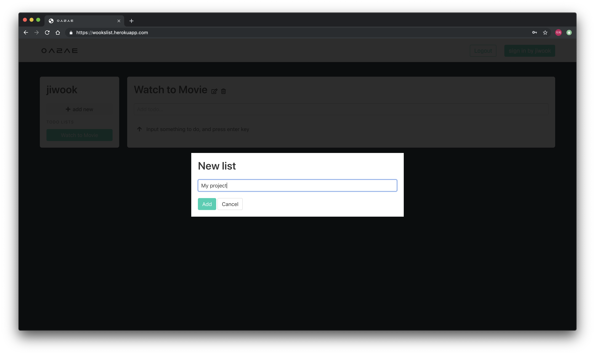

# ㅇㅅㄹㅅㅌ / Wookslist

> Plan Your Life and Never Be Stuck Again

* 뽀짝한 미니멀 디자인 Todo SPA

  페이지 리로드 없이 구현한 Single Page Application


## 1. Demo or local Install

#### 1) 데모 앱 배포

Demo App 을 [Heroku](https://www.heroku.com/) 을 이용해 배포했습니다.

* [Go to Heroku Demo App](https://wookslist.herokuapp.com/)


#### 2) 설치 및 로컬환경 실행

1. `pip install` 명령어를 통해 `requirements.txt` 에 저장된 프로젝트에 필요한 패키지를 설치합니다.

  ```
  > pip install -r requirements.txt
  ```

2. migrate를 한 뒤 Django 프로젝트를 실행합니다.

  ```
  > python manage.py migrate
  > python manage.py runserver
  ```

3. 만약 서버에 접속되지 않는다면, `wookslist/settings.py` 의 `ALLOWED_HOSTS` 를 수정해줍니다.

   ```python
   ALLOWED_HOSTS = [
     'wookslist.herokuapp.com',
     '127.0.0.1',
     # <your address>
   ]
   ```

   


## 2. 기술 스택

Django Project 기반으로 Django template 에 Vue.js 를 적용하여 개발했습니다.

#### Frontend

- Vue : 2.6.10
- Axios : 0.18.0
- Bulma : 0.7.4
- Font Awesome : 5.8.2

#### Backend

- Django : 2.2.1
- Django REST framework : 3.9.4
- Python : 3.7.2


## 3. 상세 기능

#### 0) 로그인

* 로그인 하지 않은 유저는 메인 페이지를 보여주고 가입할 수 있도록 합니다.
* 로그인 한 유저는 메인 페이지 대신 유저의 Todo List 를 보여줄 수 있도록 분기합니다.

#### 1) List 생성, 수정, 삭제

* Todo 리스트를 담을 수 있는 List 를 생성해, group 화 해 Todo 를 관리할 수 있습니다.
* List 제목 우측의 아이콘을 클릭하면 제목 수정, 삭제 할 수 있습니다.

#### 2) Todo 작성

* List 를 생성하고 선택하면, Todo 를 생성할 수 있습니다.
* Todo 제목을 입력하고 엔터를 누르면 상세 입력 페이지에서 마감기한과 내용을 선택적으로 기입할 수 있습니다.

#### 3) Todo 중요, 완료 표시 및 정렬

* Todo 마다 :star: :ballot_box_with_check: 아이콘을 출력해서 중요 표시, 완료 했음을 표시할 수 있습니다.
* List 에 담긴 모든 Todo 를 기한이 지난 것부터 중요도, 완료 여부에 따라서 정렬해줍니다.

#### 4) Todo 상세보기, 수정 및 삭제

* Todo 를 클릭하면 상세보기 페이지를 보여줍니다.
* List 와 동일하게 Todo 를 수정하고 삭제할 수 있습니다.


## 4. 스크린샷





